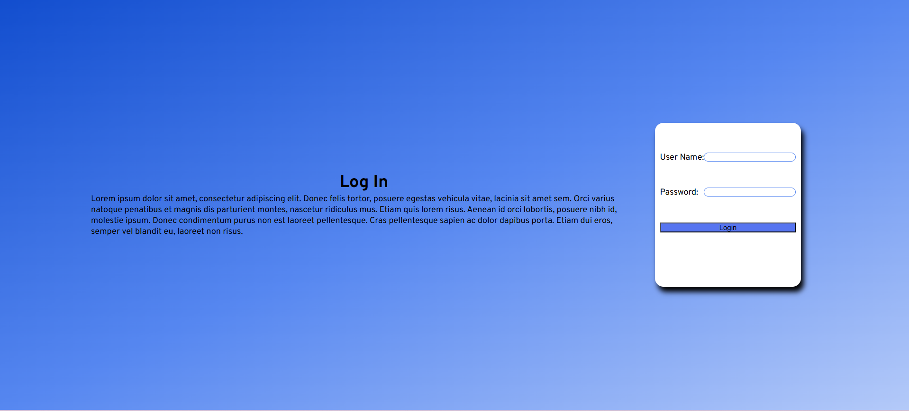

# Login Form — HTML / CSS / JS

## Summary
Simple login form built to practice frontend fundamentals: layout, validation, DOM events, and async API calls.

## Tech stack
- HTML
- CSS (Flexbox)
- Vanilla JavaScript (ES6+)

## Features
- Responsive centered login card
- Client-side validation (shows inline errors)
- Loading state + fake API call (using fetch / async-await)
- Clean separation of HTML / CSS / JS

## How to run
1. Clone the repo:
   `git clone https://github.com/SamBase/web-learning.git`
2. Open `html-css/index.html` in your browser.
(Or enable GitHub Pages to serve the static site.)

## Screenshots
Add screenshots to the `assets/` folder and reference them here.

## Notes / Next steps
Planned improvements:
- Add unit tests
- Convert to React app for state handling
- Deploy to Netlify / Vercel

